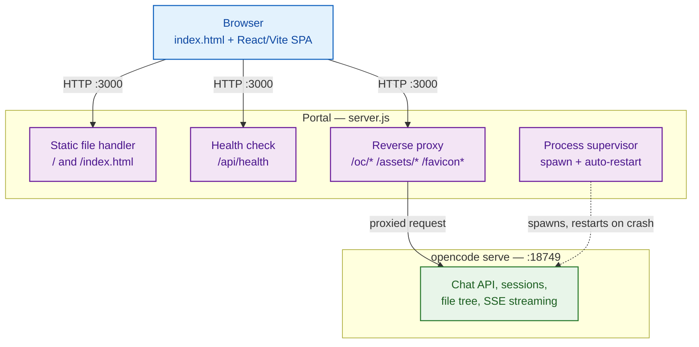
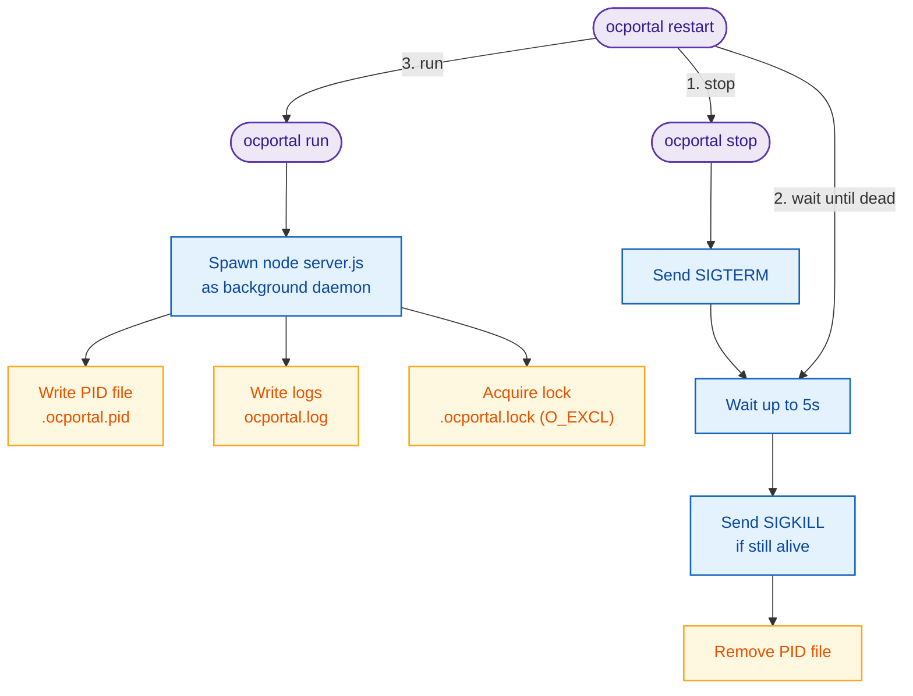
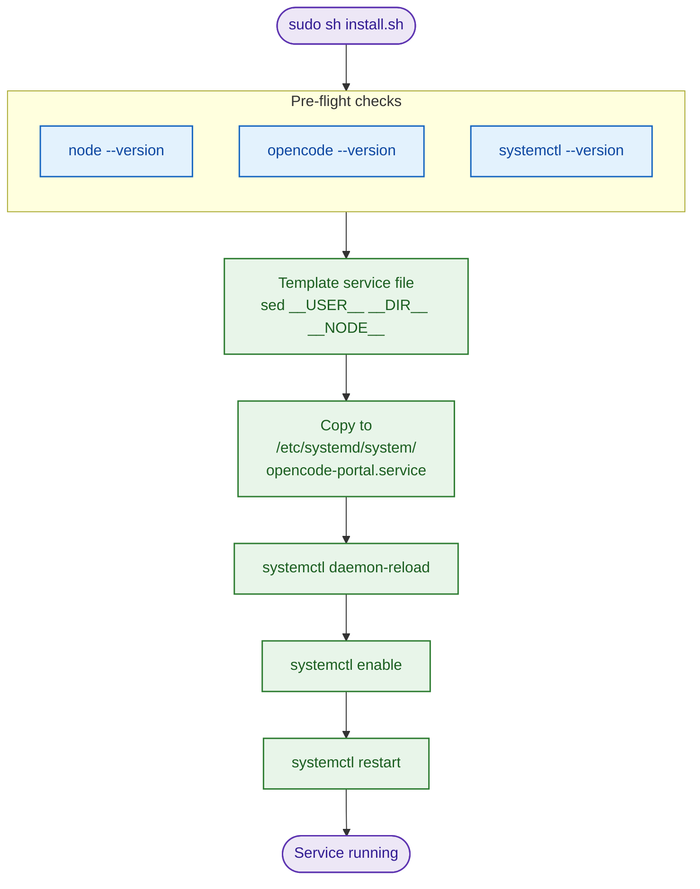
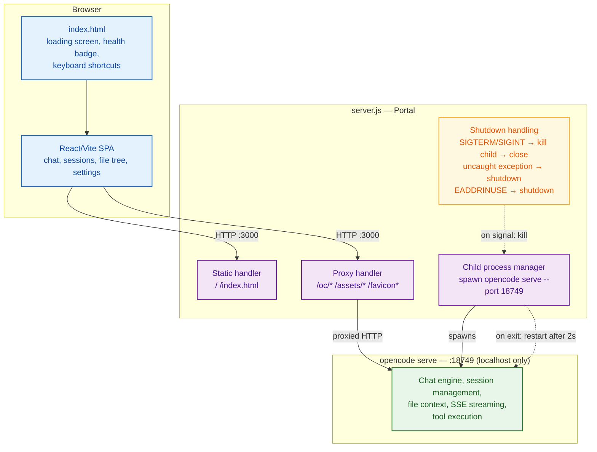

<div align="center">

# ⚡ OpenCode Portal

**A lightweight web GUI for [OpenCode](https://opencode.ai) — the AI coding agent that lives in your terminal, now reachable from any browser on your LAN.**

[](https://nodejs.org)
[](#license)
[](#1-quick-daemon-systemd)
[]()

</div>

---

## Table of Contents

- [Why this exists](#why-this-exists)
- [How it works](#how-it-works)
- [Prerequisites](#prerequisites)
- [Quick start](#quick-start)
- [CLI reference](#cli-reference)
- [Installation methods](#installation-methods)
- [Configuration](#configuration)
- [API](#api)
- [Architecture](#architecture)
- [File structure](#file-structure)
- [Security](#security)
- [Troubleshooting](#troubleshooting)
- [Known limitations](#known-limitations)
- [FAQ](#faq)
- [Development](#development)
- [Roadmap ideas](#roadmap-ideas)
- [License](#license)

---

## Why this exists

`opencode` is a fantastic terminal-native coding agent, but a terminal is a single-seat, single-machine experience. **OpenCode Portal** wraps `opencode serve` in a small, dependency-light Node.js process that:

- Exposes a browser-based chat UI (React/Vite SPA) for sessions, file tree browsing, and streaming responses.
- Keeps the actual `opencode serve` backend bound to `127.0.0.1` — never exposed directly.
- Supervises the backend process: spawns it, restarts it on crash, and shuts it down cleanly.
- Adds a couple of quality-of-life layers (health checks, request logging, a CLI daemon wrapper) that a raw `opencode serve` doesn't give you.

In short: point a phone, tablet, or another machine on your LAN at `http://<host>:3000` and you have a coding agent chat interface without needing a terminal session open on that device.

---

## How it works



The portal is a **thin proxy + process supervisor** — it does not reimplement any agent logic. All chat/session/tool intelligence lives in `opencode serve`; the portal just gives it a front door.

---

## Prerequisites

| Requirement | Version | Notes |
|---|---|---|
| [Node.js](https://nodejs.org) | ≥ 18 | Runtime |
| [opencode CLI](https://opencode.ai) | latest | Backend — the portal wraps this |
| systemd (optional) | — | For auto-start on boot via `install.sh` |

The portal does **not** bundle the opencode CLI — install it separately:

```sh
# macOS / Linux
curl -fsSL https://opencode.ai/install.sh | sh

# Or via npm
npm install -g @opencode/cli
```

> 💡 Sanity check before anything else: `opencode --version` and `node --version` should both resolve. Most first-run issues trace back to one of these not being on `PATH`.

---

## Quick start

```sh
ocportal run
# Open http://localhost:3000
```

Or run directly without the CLI wrapper:

```sh
node server.js
# Open http://localhost:3000
```

**Fastest possible smoke test:**

```sh
node server.js &
sleep 1
curl -s http://localhost:3000/api/health
# {"status":"ok"}
```

---

## CLI reference

### Global install

```sh
npm link           # dev install from this repo
npm install -g .   # or install from local path
```

### Commands

| Command | Description | Notes |
|---|---|---|
| `ocportal run` | Start daemon in background | Logs to `ocportal.log` |
| `ocportal stop` | Stop daemon | Waits 5s, force-kills if stuck |
| `ocportal restart` | Restart daemon | Waits for port release |
| `ocportal open` | Open portal in browser | macOS/Win/Linux |
| `ocportal status` | Show running/stopped | Reads PID file |
| `ocportal config` | Show PORT, ROOT, PID_FILE, LOG_FILE | Debug info |
| `ocportal logs` | Tail live log | `ocportal logs --size` for file size |
| `ocportal foreground` | Run in foreground | For debugging, no daemon |

### CLI flags

| Flag | Works with | Effect |
|---|---|---|
| `--force` | `run`, `stop` | Override stale PID |
| `--size` | `logs` | Show log file size (KB) |
| `--help` / `-h` | any | Show help |
| `--version` / `-v` | any | Show version |

### Lifecycle



**Cheat sheet:**

```sh
ocportal run           # start it
ocportal status        # is it up?
ocportal logs          # tail the log
ocportal logs --size   # how big has it gotten?
ocportal restart       # kick it
ocportal stop --force  # nuke a stuck PID
```

---

## Installation methods

### 1. Quick daemon (systemd)

```sh
sudo sh install.sh
```

The install script:

1. Checks prerequisites: `node`, `opencode`, `systemctl`
2. Templates the service file with your user, directory, and node path
3. Installs to `/etc/systemd/system/opencode-portal.service`
4. Enables and starts the service



**Management:**

```sh
# Check status
systemctl status opencode-portal --no-pager

# View logs
journalctl -u opencode-portal -f

# Stop
sudo systemctl stop opencode-portal

# Disable autostart entirely
sudo systemctl disable opencode-portal
```

### 2. Direct (no systemd)

```sh
# Foreground (for testing)
./start.sh
# or
node server.js

# Daemon (via CLI)
ocportal run
```

### Which method should you use?

| Scenario | Recommended method |
|---|---|
| Always-on home server / mini PC | systemd (`install.sh`) |
| Quick local testing | `node server.js` or `./start.sh` |
| CI / ephemeral container | `ocportal foreground`, controlled by your own supervisor |
| macOS / Windows dev machine | `ocportal run` (CLI daemon, no systemd needed) |

---

## Configuration

### Environment variables

| Variable | Default | Description |
|---|---|---|
| `PORT` | `3000` | Portal HTTP port (for `server.js`) |
| `OPENCODE_SERVER_PASSWORD` | `''` (empty) | Password for internal opencode serve |
| `LOG_REQUESTS` | `0` | Set to `1` to log each HTTP request with method, URL, status, duration |

> **Note on `PORT`:** The CLI wrapper passes `PORT` through. `server.js` defaults to `3000`. `start.sh` defaults to `3000`. If you run `ocportal run` without setting `PORT`, the portal listens on `3000`. A non-numeric `PORT` value falls back to `3000` silently — check `ocportal config` if a custom port doesn't seem to take.

### Internal ports

| Port | Process | Access |
|---|---|---|
| `3000` | Portal (server.js) | Public (LAN/all interfaces if bound to 0.0.0.0) |
| `18749` | opencode serve | localhost only (127.0.0.1) — not exposed |

### Example: custom port + password + verbose logging

```sh
PORT=8080 \
OPENCODE_SERVER_PASSWORD=correct-horse-battery-staple \
LOG_REQUESTS=1 \
ocportal run
```

---

## API

### Portal endpoints

| Method | Path | Description |
|---|---|---|
| GET | `/api/health` | Health check. Returns `{"status":"ok"}` or `{"status":"dead"}`. Used by frontend badge. |

### Proxied endpoints (to opencode serve on `localhost:18749`)

All paths starting with `/oc/` or `/oc` are transparently proxied to opencode serve, including query strings and request body. Same for `/assets/*`, `/favicon*`, `/apple-touch-icon*`, `/site.webmanifest`, and `/social-share.png`.

**Key proxied routes:**

| Method | Path | Purpose |
|---|---|---|
| GET | `/oc/global/health` | Backend health |
| POST | `/oc/session` | Create new session |
| GET | `/oc/session` | List sessions |
| POST | `/oc/session/:id/message` | Send message |
| GET | `/oc/session/:id/message` | Get messages |
| POST | `/oc/session/:id/message/stream` | Stream response (SSE) |
| GET | `/oc/context` | List context files |
| GET | `/oc/files` | File tree |

> The portal is a pass-through proxy for these — it doesn't inspect or modify the request. Refer to the [opencode API docs](https://opencode.ai/docs) for full schema.

### Example: scripted session via curl

```sh
# 1. Create a session
SESSION_ID=$(curl -s -X POST http://localhost:3000/oc/session | jq -r '.id')

# 2. Send a message
curl -s -X POST http://localhost:3000/oc/session/$SESSION_ID/message \
  -H "Content-Type: application/json" \
  -d '{"content": "List the files in the current directory"}'

# 3. Stream the response
curl -N -X POST http://localhost:3000/oc/session/$SESSION_ID/message/stream
```

---

## Architecture



### Design principles

- **Single responsibility.** The portal serves static assets, proxies API traffic, and supervises one child process. It does not touch agent state.
- **Fail loud, recover fast.** Any crash of `opencode serve` triggers an automatic restart after a fixed 2s backoff — no exponential backoff, no crash-loop detection (see [Known limitations](#known-limitations)).
- **Localhost-first security.** The sensitive backend never binds beyond `127.0.0.1`; only the thin proxy layer is LAN-facing.

---

## File structure

```
opencode-portal/
├── server.js                     # HTTP server + proxy + child process manager
├── cli.js                        # CLI: run/stop/restart/open/logs/etc.
├── package.json                  # Metadata, bin, scripts
├── install.sh                    # systemd service installer (template vars)
├── start.sh                      # Foreground launcher for testing
├── opencode-portal.service       # systemd unit file (templated)
├── .gitignore
├── README.md
├── public/
│   ├── index.html                # SPA shell + enhancement script
│   ├── favicon-96x96-v3.png
│   ├── favicon-v3.svg
│   ├── favicon-v3.ico
│   ├── apple-touch-icon-v3.png
│   ├── site.webmanifest
│   └── social-share.png
└── .opencode-workspace/          # Project memories (not shipped)
    └── opencodememories/
        ├── ISSUE_LOG.md
        ├── MEMORIES.md
        └── USER.md
```

---

## Security

| Concern | Status |
|---|---|
| Internal opencode auth | Disabled by default (`OPENCODE_SERVER_PASSWORD=''`) |
| External access | Portal binds `0.0.0.0:3000` — LAN-accessible |
| opencode serve | `127.0.0.1:18749` — localhost only |
| TLS/HTTPS | Not supported (localhost-only by design; use a reverse proxy for LAN) |
| CSP header | Conservative: `self` + inline styles/scripts only |

**Recommendations for production-like setups:**

- Set `OPENCODE_SERVER_PASSWORD` if opencode serve needs auth.
- Put behind nginx/Caddy with TLS for LAN access.
- Use firewall rules to restrict port 3000 to trusted subnets/devices.
- If exposing beyond your LAN (e.g. via a VPN or tunnel), treat this like any other unauthenticated-by-default dashboard: put it behind a reverse proxy that adds its own auth layer (basic auth, OAuth2 proxy, etc.) rather than relying on the portal itself.

**Threat model, briefly:** the portal assumes the LAN it's bound to is trusted. It is *not* designed to be internet-facing without a reverse proxy adding TLS and authentication in front of it.

---

## Troubleshooting

| Symptom | Likely cause | Fix |
|---|---|---|
| `Failed to spawn opencode serve` | opencode CLI not installed or not in PATH | `which opencode` / install from [opencode.ai](https://opencode.ai) |
| `Address already in use :3000` | Port conflict | `PORT=3001 ocportal run` or kill the process on port 3000 |
| Dashboard says "disconnected" in red | opencode serve crashed | Check `ocportal.log` or `journalctl -u opencode-portal -f` |
| Connection resets / 502 errors | opencode serve restarting | Wait 2-3s for auto-restart |
| Blank white page after loading screen | App failed to load in 8s | Check browser console for errors, reload |
| `ocportal open` does nothing | No xdg-open/open/cmd | Manually open `http://localhost:3000` |
| Systemd service won't start | `set -e` aborted install | Run `systemctl status opencode-portal --no-pager` |
| `PORT=abc` behaves unexpectedly | Non-numeric PORT | Server falls back to 3000 |
| Portal reachable but chat never responds | `opencode serve` stuck in a crash loop | Tail logs; if it's flapping every 2s, kill the daemon, run `opencode serve` manually in foreground to see the raw error |
| Works on `localhost` but not from another LAN device | Firewall blocking port 3000, or portal bound to `127.0.0.1` only | Check firewall rules; confirm portal is bound to `0.0.0.0` |

### Logs

| Source | Location | How to read |
|---|---|---|
| Portal log | `ocportal.log` (in project root) | `ocportal logs` or `tail -f ocportal.log` |
| Systemd service | journald | `journalctl -u opencode-portal -f` |
| Server stdout | Inherited from parent process | `ocportal foreground` |

Enable request logging for debugging:

```sh
LOG_REQUESTS=1 ocportal run
# Now ocportal.log shows: GET /api/health 200 2ms
```

---

## Known limitations

- **No TLS** — The portal doesn't support HTTPS. Use a reverse proxy (nginx/Caddy) for encrypted LAN access.
- **No log rotation** — `ocportal.log` grows unbounded. Monitor with `ocportal logs --size` or set up `logrotate`.
- **Single process** — No clustering. One Node.js process handles all requests.
- **Linux-focused** — systemd service and `xdg-open` assumption. macOS works via `open`; Windows supported in CLI but not systemd.
- **opencode required** — The portal is useless without the opencode CLI installed separately.
- **Fixed restart backoff** — The 2s restart delay on child-process crash is constant, not exponential; a genuinely broken `opencode` install will crash-loop indefinitely rather than backing off.

---

## FAQ

**Does this replace `opencode` itself?**
No — it's a GUI shell around `opencode serve`. All the actual agent behavior, model calls, and tool execution come from the CLI you install separately.

**Can I use this from my phone?**
Yes, as long as your phone is on the same LAN (or VPN) as the machine running the portal, and port 3000 is reachable.

**Is my data sent anywhere besides my own machine and the model provider opencode is configured to use?**
No — the portal itself doesn't add any telemetry or third-party calls. It only proxies to your local `opencode serve` instance.

**Can multiple people use the portal at once?**
The portal itself doesn't restrict concurrent connections, but `opencode serve` session state is what determines whether that's a good idea in practice — check the [opencode docs](https://opencode.ai/docs) for its session model.

**Why port 18749 for the internal server?**
It's just a fixed, unlikely-to-collide high port chosen for the internal, localhost-only `opencode serve` process. It's not configurable via env var in the current version — if you need to change it, it's in `server.js`.

---

## Development

```sh
git clone https://github.com/PavaraM/opencode-portal.git
cd opencode-portal

# Run in foreground with auto-reload
node server.js

# Edit public/index.html — all enhancement logic is inline
# Edit server.js — proxy config, static serving, process management
```

**Suggested workflow for changes:**

1. Run `node server.js` in one terminal, tail `ocportal.log` in another.
2. Hit `/api/health` after every change to confirm the portal itself is alive.
3. Hit `/oc/global/health` to confirm the proxy → backend path is intact.
4. For frontend changes, hard-refresh (disable cache) since `public/index.html` is served directly, not through a bundler dev server.

---

## Roadmap ideas

> Not commitments — just directions worth considering as the project matures.

- [ ] Exponential backoff (with a cap) instead of a fixed 2s restart delay
- [ ] Built-in log rotation for `ocportal.log`
- [ ] Optional basic-auth layer on the portal itself, for lighter-weight LAN protection without a full reverse proxy
- [ ] `ocportal doctor` — a one-shot command that runs all the prerequisite/PATH/port checks in [Prerequisites](#prerequisites) and [Troubleshooting](#troubleshooting)
- [ ] Configurable internal port for `opencode serve` (currently fixed at `18749`)

---

## License

ISC
